# 🧑‍🎓 Student Study Portal (Django)

A comprehensive web-based **Student Study Portal** built using Django that helps students manage and access their daily study resources and tasks efficiently. The portal includes features like **To-Do lists, Homework Tracker, Notes, Books, Wikipedia Search, Dictionary**, and user authentication system.

---

# Deployed Link: https://studentportal-g9r0.onrender.com/

---

## 🌐 Features

- 🔐 **Authentication**: User **Register**, **Login**, and **Logout**
- 🏠 **Home Page**: General info or dashboard
- 🙍‍♂️ **Profile Page**:
  - Displays **To-Do List**
  - Shows **Homework Submissions**
- 📚 **Study Tools** under Options (Dropdown):
  - 📖 **Books Search**
  - 🌐 **Wikipedia Search**
  - 📘 **Dictionary Lookup**
  - ✅ **To-Do List Manager**
  - 📝 **Homework Tracker**
  - 🗒️ **Notes Manager**

---

## 🧭 Navigation Bar Includes:

- `Home`
- `Profile` – Shows your To-Dos and Homework
- `Options` (Dropdown):
  - `Books`
  - `Wikipedia`
  - `Dictionary`
  - `To-Do`
  - `Homework`
  - `Notes`
- `Register`
- `Login`
- `Logout`

---

## 🚀 Tech Stack

| Tech         | Description                             |
|--------------|-----------------------------------------|
| Django       | Backend web framework                   |
| HTML/CSS     | Frontend structure and styling          |
| Bootstrap    | For responsive and styled UI components |
| SQLite       | Default database for development        |
| External APIs| Google Books, Dictionary, Wikipedia     |

---

## Screenshots

To provide a better understanding of the Student Study Portal application, here is a screenshot:

##Home Interface

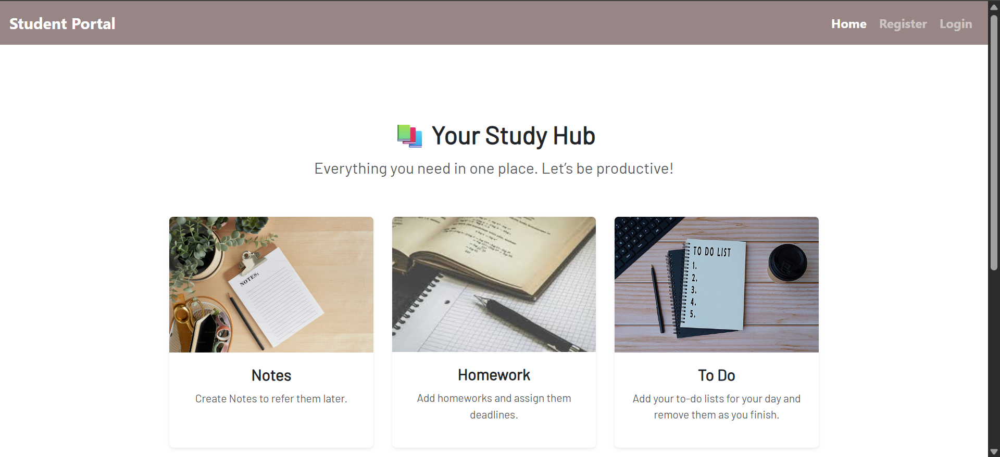

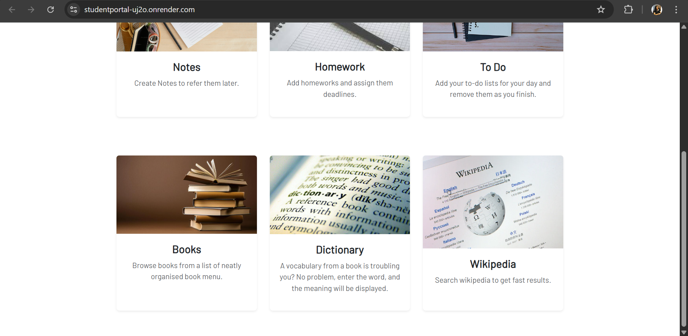

##Profile Interface

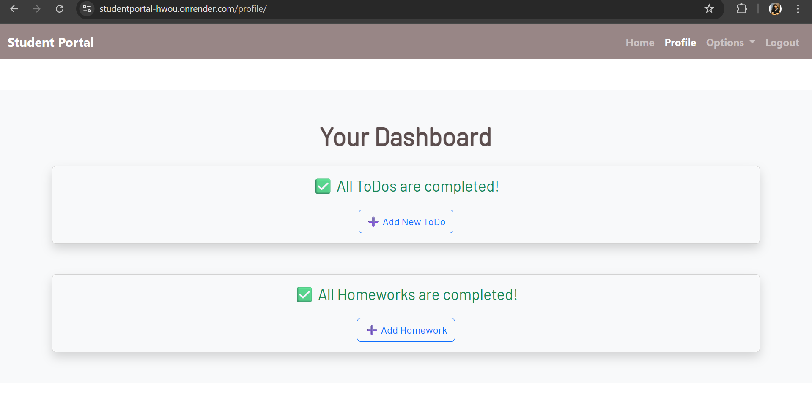

##Register Interface

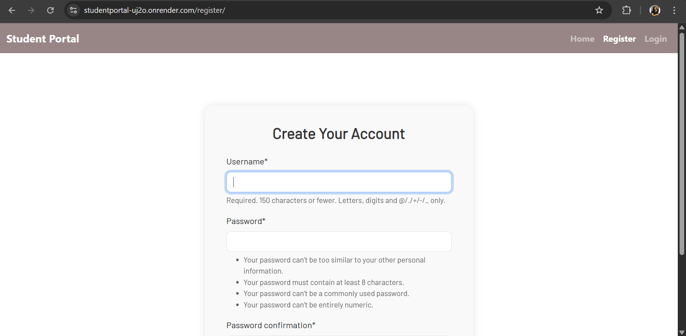

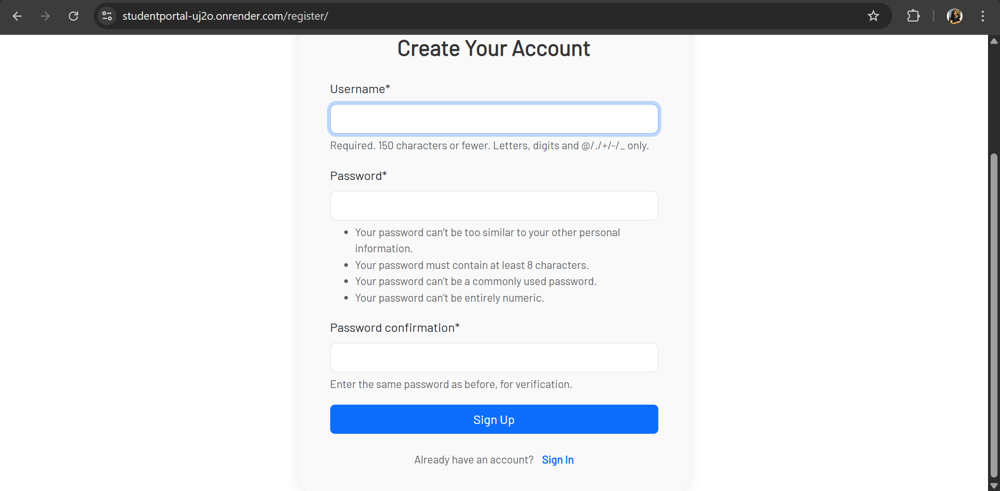

##Login Interface

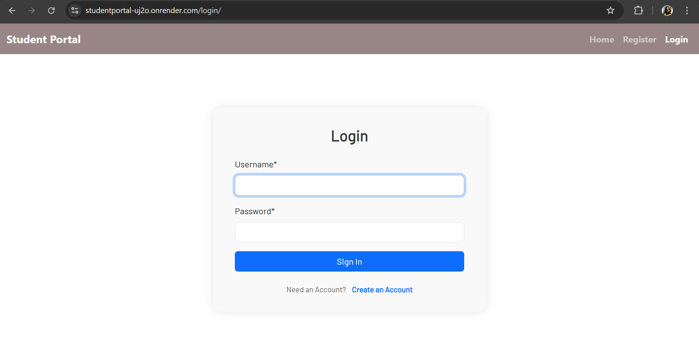

##User Interface

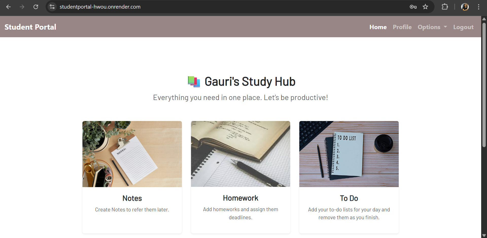

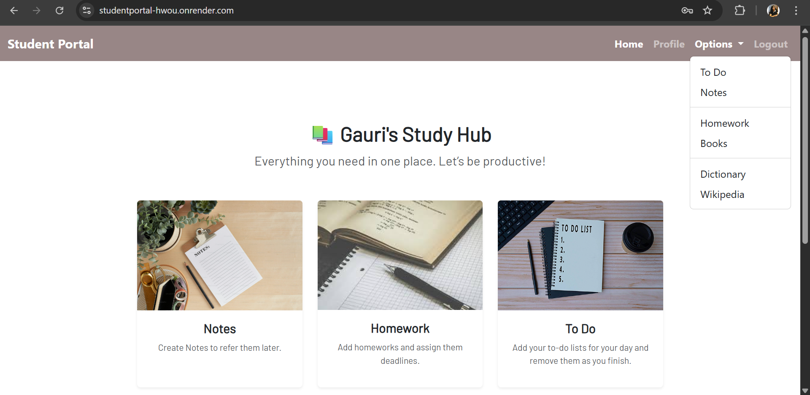

##Notes Interface

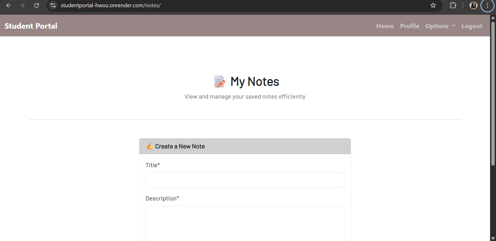

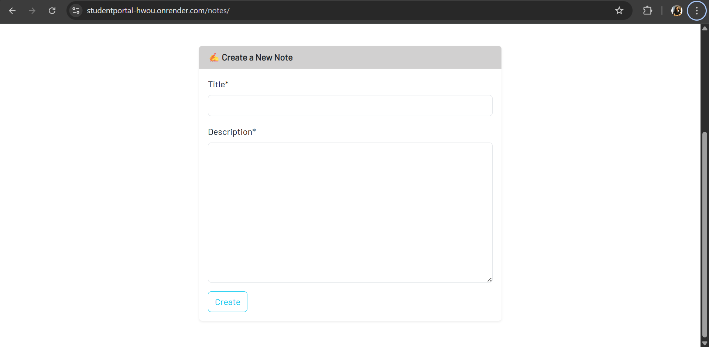

##Homework Interface

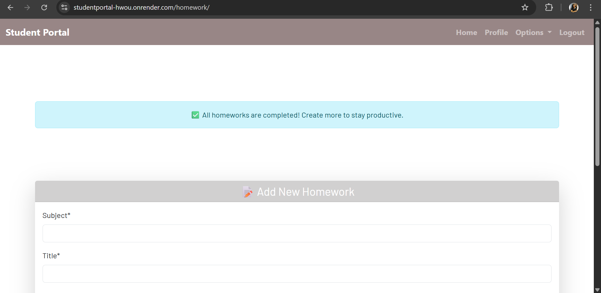

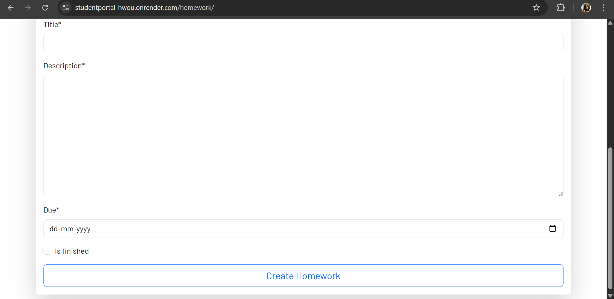

##Todo Interface

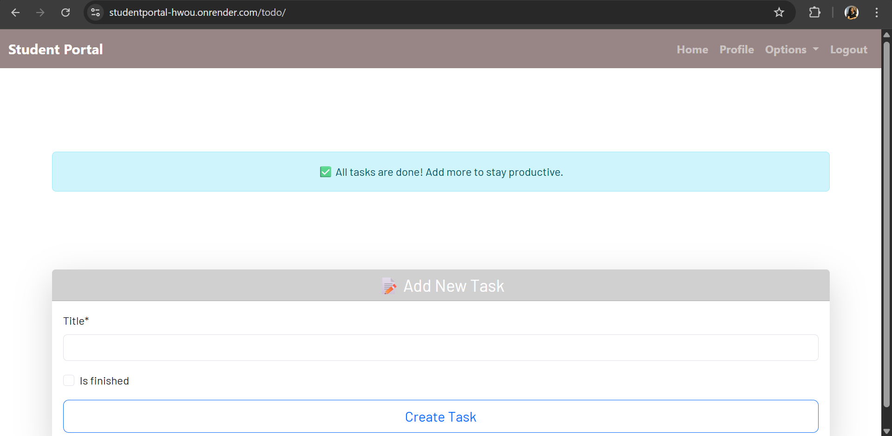

##Books Interface

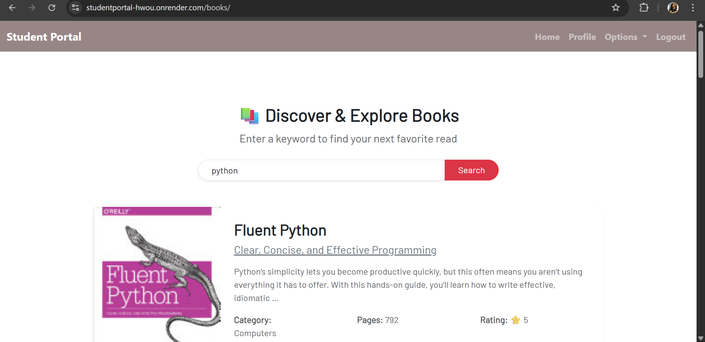

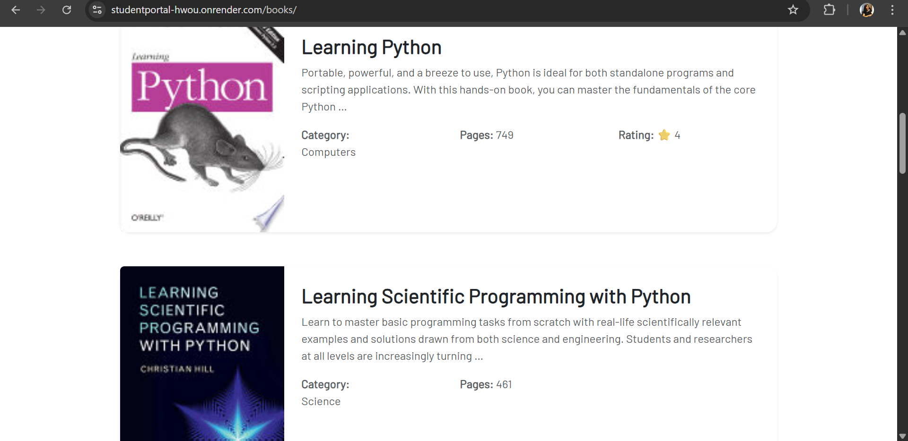

##Dictionary Interface

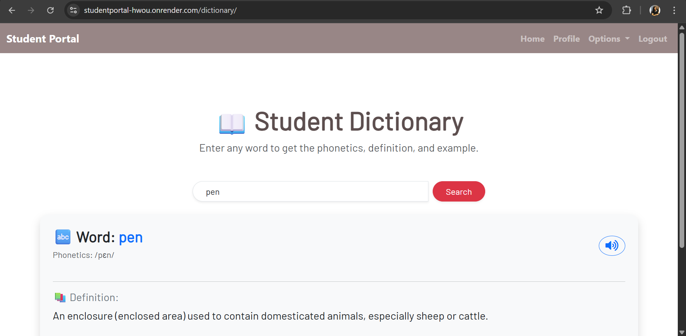

##Wikipedia Interface

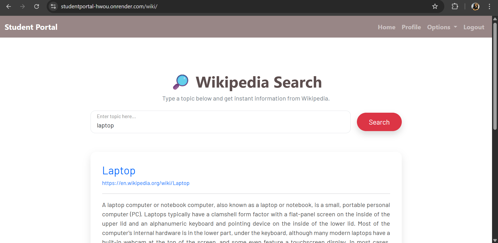

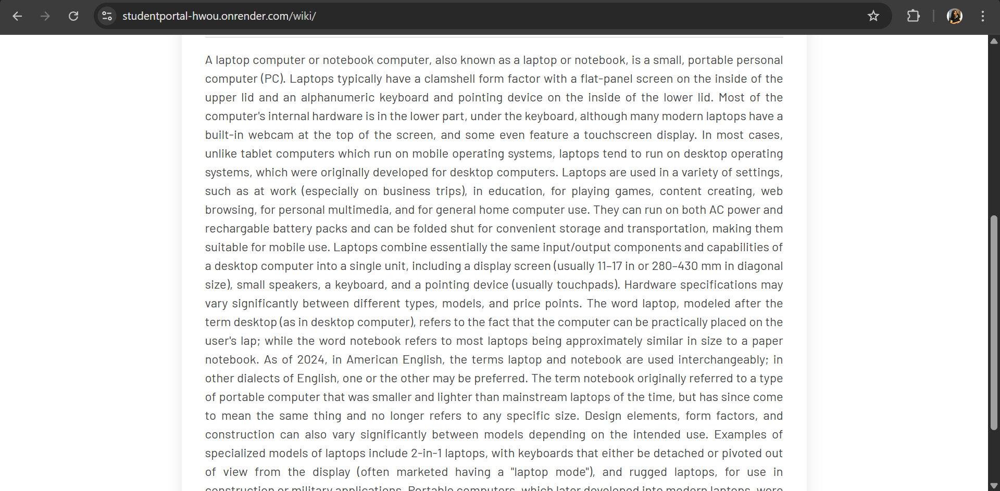
